<div align="center">

<!-- ✨ Animated Banner ✨ -->
<picture>
  <source media="(prefers-color-scheme: dark)" srcset="./banner.svg">
  <source media="(prefers-color-scheme: light)" srcset="./zawar_tahir_banner_light.svg">
  
</picture>

</div>

<br/>

<table align="center" border="0">
<tr>
<td width="34%" align="center" valign="middle">

<!-- 🪪 Swinging Lanyard ID Card, pure SVG -->


</td>
<td width="66%" valign="middle">

### 🚀 &nbsp;What I Build

| 🎯 Focus Area | 💻 Tech | ⚡ |
|:---|:---:|:---:|
| Full-Stack Web Apps | `React` `Next.js` `Node.js` `MongoDB` | 🔥 |
| Agentic AI Workflows | `Prompt Engineering` `AI Agents` | 🤖 |
| Business Process Automation | `n8n` `Automation` `APIs` | ⚙️ |
| UI / UX & Styling | `Tailwind CSS` `Figma` | 🎨 |
| Cloud & Deployment | `Docker` `AWS` `Vercel` | ☁️ |

<br/>

> 💜 *"Code. Coffee. Repeat."*

</td>
</tr>
</table>

<br/>


## 👾 &nbsp;About Me

<table>
<tr>
<td width="58%" valign="top">

```ansi
[SYSTEM BOOT] > Loading Zawar_Tahir_Profile...
[STATUS]      > Online ⚡ | Mode: Full-Stack + Agentic AI
```

👨‍💻 **Full-Stack Web Developer | Agentic AI Developer | Automation Expert**

Hey there! I'm **Zawar Tahir** — a passionate developer who bridges the gap between traditional robust web development and next-generation intelligent automation.

🎯 **What drives me?** Transforming complex business ideas into seamless, high-performance digital assets. I specialize in building full-stack applications with the **MERN Stack** and expanding boundaries with **Agentic AI** to create smart, self-improving digital teammates. My goal is to craft scalable architectures and intelligent workflows that deliver measurable results.

🚀 **Quick Highlights:**
- 🔭 **Currently working on:** Advanced Blog Automation & Autonomous AI Workflows
- 🌱 **Mastering:** Deep diving into **n8n Automation**, Advanced Prompt Engineering, and Platform Scaling
- 💬 **Ask me about:** React, Node.js, MongoDB, Agentic AI, UI/UX, or SEO Optimization
- ⚡ **Fun Fact:** I once tried to build an AI agent to automatically reply to my emails... It ended up trying to negotiate a corporate partnership with my local pizza guy! 🍕🤖

</td>
<td width="42%" align="center">


<br/>


</td>
</tr>
</table>


## 🌐 &nbsp;Connect With Me

<p align="center">
<a href="https://instagram.com/zawar_tahir"></a>
<a href="https://linkedin.com/in/zawar-tahir"></a>
<a href="mailto:chzawartahir12@gmail.com"></a>
</p>


## 💻 &nbsp;Tech Stack

                              

## 🎨 &nbsp;Frontend Development
<p align="left">


</p>

## ⚙️ &nbsp;Backend & Databases
<p align="left">


</p>

## 🐳 &nbsp;DevOps & Cloud Infrastructure
<p align="left">


</p>

## 🛠️ &nbsp;Tools & Workflow
<p align="left">


</p>


<div align="center">

### 📊 &nbsp;GitHub Stats & Graphs


<br/><br/>


<br/><br/>

<!-- 📈 Contribution Activity Graph -->


<br/><br/>

<!-- 🏆 Trophies -->
<!--  -->

<br/><br/>

### 🐍 &nbsp;Watch the snake eat my contributions


<br/><br/>


<br/><br/>

*⭐️ Always learning, always building.* 💜


</div>
